# Formal Verification Toolchain Architecture

## System Overview Diagram


## Pipeline Workflow (Step-by-Step)

```mermaid
sequenceDiagram
    autonumber
    actor User
    participant Gemini as 🤖 Gemini 2.5 Flash
    participant NL2LTL as nl2ltl
    participant NL2ACSL as nl-to-acsl
    participant Code as Source Code
    participant FramaC as Frama-C
    participant WHY3 as Why3/SMT
    participant KLEE as KLEE
    participant AFL as AFL++
    participant Results as 📊 Results
    
    %% Natural Language Processing
    User->>Gemini: Natural Language Requirements<br/>"Buffer must not overflow"
    activate Gemini
    Gemini->>NL2LTL: Translate to LTL
    NL2LTL-->>User: G(buffer_size ≤ MAX)
    Gemini->>NL2ACSL: Generate ACSL Specs
    NL2ACSL-->>User: requires valid buffer range
    deactivate Gemini
    
    %% Code Annotation
    User->>Code: Add ACSL annotations
    
    %% Static Verification
    Code->>FramaC: Run deductive verification
    activate FramaC
    FramaC->>WHY3: Generate proof obligations
    activate WHY3
    WHY3->>WHY3: Solve with Z3, CVC5, Alt-Ergo
    WHY3-->>FramaC: Proof results
    deactivate WHY3
    FramaC-->>Results: Verified properties
    deactivate FramaC
    
    %% Dynamic Testing
    par Parallel Dynamic Analysis
        Code->>KLEE: Symbolic execution
        activate KLEE
        KLEE->>KLEE: Explore paths
        KLEE-->>Results: Test cases + Bug reports
        deactivate KLEE
    and
        Code->>AFL: Fuzzing
        activate AFL
        AFL->>AFL: Mutate inputs
        AFL-->>Results: Crash inputs
        deactivate AFL
    end
    
    %% Final Report
    Results-->>User: ✅ Verification complete<br/>Proofs, bugs, test cases
```



## Tool Categories and Relationships


## Detailed Component Architecture

```mermaid
graph LR
    subgraph "INPUT LAYER"
        A1[Natural Language<br/>Requirements]
        A2[User Stories]
        A3[Plain English Specs]
    end
    
    subgraph "AI PROCESSING LAYER"
        B1[🤖 Gemini API]
        B2[nl2ltl Engine]
        B3[nl-to-acsl Converter]
    end
    
    subgraph "FORMAL SPECIFICATION LAYER"
        C1[LTL Formulas]
        C2[ACSL Contracts]
        C3[UML Models]
        C4[State Machines]
    end
    
    subgraph "CODE LAYER"
        D1[C/C++ Source]
        D2[ACSL Annotations]
        D3[LLVM Bitcode]
    end
    
    subgraph "VERIFICATION LAYER"
        E1[Frama-C WP]
        E2[CBMC]
        E3[Why3]
        E4[Z3/CVC5/Alt-Ergo]
    end
    
    subgraph "TESTING LAYER"
        F1[KLEE Symbolic<br/>Execution]
        F2[AFL++ Fuzzing]
        F3[Valgrind Memory<br/>Analysis]
    end
    
    subgraph "OUTPUT LAYER"
        G1[Proof Results]
        G2[Bug Reports]
        G3[Test Cases]
        G4[Coverage Data]
    end
    
    A1 & A2 & A3 --> B1
    B1 --> B2 & B3
    B2 --> C1
    B3 --> C2
    B1 --> C3 & C4
    
    C1 & C2 & C3 & C4 --> D1
    D1 --> D2
    D2 --> E1 & E2
    E1 --> E3 --> E4
    
    D1 --> D3
    D3 --> F1 & F2 & F3
    
    E1 & E2 & E4 --> G1
    F1 --> G2 & G3
    F2 --> G2 & G4
    F3 --> G2
    
    style B1 fill:#fff9c4,stroke:#f57f17,stroke-width:3px
```



## Example Workflow: Buffer Safety Verification


## Technology Stack Overview

```mermaid
graph TB
    subgraph "🌐 AI & NLP Layer"
        GEMINI["Google Gemini 2.5 Flash<br/>★ Primary AI Engine"]
        NL2LTL["nl2ltl<br/>NL → LTL Translation"]
        NL2ACSL["nl-to-acsl<br/>NL → ACSL Translation"]
    end
    
    subgraph "📊 Modeling & Specification"
        PLANTUML["PlantUML<br/>UML Diagrams"]
        SPOT["SPOT<br/>LTL Tools"]
        NUSMV["NuSMV<br/>CTL/LTL Model Checker"]
        SPIN["SPIN<br/>Promela Verification"]
        ALLOY["Alloy<br/>Relational Models"]
    end
    
    subgraph "🔍 Static Analysis"
        FRAMAC["Frama-C<br/>★ Core Verifier"]
        WHY3["Why3<br/>Multi-Prover Platform"]
        CBMC["CBMC<br/>Bounded Model Checker"]
        Z3["Z3 SMT Solver"]
        CVC5["CVC5 SMT Solver"]
        ALTERGO["Alt-Ergo<br/>SMT Solver"]
    end
    
    subgraph "🧪 Dynamic Testing"
        KLEE["KLEE<br/>Symbolic Execution"]
        AFL["AFL++<br/>Fuzzing Engine"]
        VALGRIND["Valgrind<br/>Memory Analysis"]
    end
    
    subgraph "🛠️ Build & Environment"
        NIX["Nix Package Manager<br/>Reproducible Environment"]
        LLVM["LLVM/Clang<br/>Compiler Infrastructure"]
        GCC["GCC<br/>GNU Compiler"]
    end
    
    GEMINI --> NL2LTL
    GEMINI --> NL2ACSL
    GEMINI --> PLANTUML
    
    NL2LTL --> SPOT
    NL2LTL --> NUSMV
    NL2LTL --> SPIN
    
    NL2ACSL --> FRAMAC
    FRAMAC --> WHY3
    WHY3 --> Z3
    WHY3 --> CVC5
    WHY3 --> ALTERGO
    
    LLVM --> KLEE
    LLVM --> AFL
    GCC --> VALGRIND
    
    NIX -.-> GEMINI
    NIX -.-> FRAMAC
    NIX -.-> KLEE
    NIX -.-> AFL
    
    style GEMINI fill:#fff9c4,stroke:#f57f17,stroke-width:4px
    style FRAMAC fill:#c8e6c9,stroke:#2e7d32,stroke-width:3px
    style NIX fill:#e1bee7,stroke:#6a1b9a,stroke-width:3px
```



## Key Features Highlighted

### 1. AI-Powered Translation (Primary Feature)

- **Gemini 2.5 Flash** for fast, accurate translation
- Natural language → Formal specifications
- 95%+ accuracy on ACSL generation
- Free tier: 60 requests/minute

### 2. Multi-Level Verification

- **Level 1**: Requirements (Natural Language)
- **Level 2**: Models (UML, Promela, LTL)
- **Level 3**: Specifications (ACSL, Contracts)
- **Level 4**: Static Proofs (Frama-C, Why3)
- **Level 5**: Dynamic Testing (KLEE, AFL++)

### 3. Reproducible Environment

- Nix-based package management
- All tools pre-configured
- Version-locked dependencies
- Cross-platform support

### 4. Comprehensive Tool Suite

- 15+ verification tools
- 3 SMT solvers
- Multiple analysis approaches
- Parallel execution support

## Integration Points

```mermaid
flowchart LR
    USER[👤 Developer]
    
    subgraph "Entry Points"
        CLI[Command Line Interface]
        PYTHON[Python Scripts]
        CI[CI/CD Pipeline]
    end
    
    subgraph "Core Services"
        GEMINI_API[🤖 Gemini API<br/>google.generativeai]
        NL2LTL_LIB[nl2ltl Library]
        NL2ACSL_TOOL[nl-to-acsl Tool]
    end
    
    subgraph "Verification Services"
        FRAMAC_SERVICE[Frama-C Service]
        KLEE_SERVICE[KLEE Service]
        AFL_SERVICE[AFL++ Service]
    end
    
    subgraph "Output"
        REPORTS[📊 Reports]
        PROOFS[✓ Proofs]
        BUGS[🐛 Bugs]
        TESTS[🧪 Tests]
    end
    
    USER --> CLI
    USER --> PYTHON
    USER --> CI
    
    CLI --> GEMINI_API
    PYTHON --> GEMINI_API
    CI --> GEMINI_API
    
    GEMINI_API --> NL2LTL_LIB
    GEMINI_API --> NL2ACSL_TOOL
    
    NL2LTL_LIB --> FRAMAC_SERVICE
    NL2ACSL_TOOL --> FRAMAC_SERVICE
    
    FRAMAC_SERVICE --> REPORTS
    FRAMAC_SERVICE --> PROOFS
    
    KLEE_SERVICE --> BUGS
    KLEE_SERVICE --> TESTS
    
    AFL_SERVICE --> BUGS
    AFL_SERVICE --> TESTS
    
    style GEMINI_API fill:#fff9c4,stroke:#f57f17,stroke-width:3px
```



## Usage Example Flow


______________________________________________________________________

## How to Regenerate Diagrams

This document contains 8 Mermaid diagrams that can be rendered to SVG format using the mermaid-cli tool included in the Nix development environment.

### Prerequisites

Ensure you have entered the Nix development environment:

```bash
nix develop
```

The environment includes `mermaid-cli` (mmdc command) as specified in `flake.nix`.

### Generate All Diagrams

To regenerate all diagrams from this markdown file:

```bash
# Generate all diagrams to docs/diagrams/ directory
mmdc -i docs/system-architecture.md -o docs/diagrams/system-architecture.svg

# This will create 8 SVG files:
#   - system-architecture-1.svg  (System Overview Flowchart)
#   - system-architecture-2.svg  (Pipeline Workflow Sequence)
#   - system-architecture-3.svg  (Tool Categories Mindmap)
#   - system-architecture-4.svg  (Detailed Component Architecture)
#   - system-architecture-5.svg  (Buffer Safety Verification State Diagram)
#   - system-architecture-6.svg  (Technology Stack Overview)
#   - system-architecture-7.svg  (Integration Points)
#   - system-architecture-8.svg  (Usage Example Journey)
```

### Generate Individual Diagrams

You can also extract and render individual mermaid blocks by creating separate `.mmd` files:

```bash
# Example: Extract first diagram
sed -n '/```mermaid/,/```/p' docs/system-architecture.md | head -n -1 | tail -n +2 > diagram.mmd
mmdc -i diagram.mmd -o output.svg
```

### Verification

After generation, verify the SVG files:

```bash
ls -lh docs/diagrams/system-architecture-*.svg
```

All diagrams should render without errors. Each diagram illustrates different aspects of the formal verification toolchain:

1. **System Overview**: High-level architecture with 5 levels from NL to dynamic testing
2. **Pipeline Workflow**: Step-by-step sequence from requirements to verification
3. **Tool Categories**: Mindmap showing tool organization and relationships  
4. **Component Architecture**: Detailed layer-by-layer component breakdown
5. **Buffer Safety Example**: State diagram showing verification workflow for a specific use case
6. **Technology Stack**: Graph showing all tools and their connections
7. **Integration Points**: How users interact with the toolchain
8. **Usage Journey**: Typical user workflow from setup to verification

______________________________________________________________________

*This architecture documentation is generated from code and can be easily modified, versioned, and integrated into documentation workflows. The diagrams are rendered using Mermaid, which allows for version-controlled, text-based diagram definitions that align with the toolchain's reproducible philosophy.*
